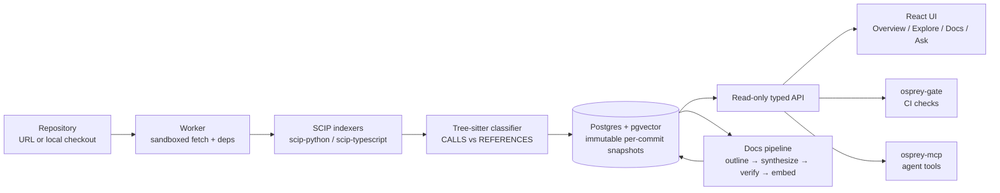

# 🦅 Osprey

**Understand any codebase in minutes.** Osprey indexes repositories into a
compiler-grade dependency graph, then serves visual exploration, grounded
AI documentation, architecture governance, and a fact-checked chat on one
core - self-hosted, local-first, air-gap friendly.


Facts come from compilers (via [SCIP](https://github.com/sourcegraph/scip)),
not heuristics. Diagrams are compiled from real edges, never drawn by a
model. Every documentation claim is cite-checked against the graph before
it publishes. The graph is useful with no LLM at all; the LLM is an
optional surface on top.

---

## Features

- **Overview dashboard**: files, languages, folders and dependencies,
  entry points, circular dependencies, likely-unused code, and the most
  depended-on symbols - with deltas against the previously analyzed
  version.
- **Explore**: an interactive dependency map (drill-down by folder, focus
  spotlighting, a plain-language insight for the focused folder), plus a
  **Focus** lens that answers, for any symbol, "what uses this" (blast
  radius) and "what this uses" (static call view) with one toggle.
- **Documentation**: persona-targeted docs (Developer, SRE / On-call,
  QA / Tester) synthesized from the same graph facts. Citations are
  verified `path:line` by `path:line`; unverifiable claims are retried,
  then stripped. Generation runs on the worker and survives navigation.
- **Staleness loop**: after every index, existing docs refresh
  automatically - a structural diff decides which pages' inputs changed,
  and only those are rewritten. Unchanged pages carry forward at zero
  token cost (an identical re-index costs exactly 0 LLM tokens).
- **Ask**: a floating chat available on every page that can only use typed
  graph tools - every answer shows which checks it ran, it refuses
  questions that are not about the indexed codebase, and it knows what you
  are currently looking at, so "what does this do?" resolves to the
  symbol or folder you have selected (then verifies it with tools).
- **Governance** (`osprey-gate`): declarative architecture rules (layers,
  deny edges, no new cycles) evaluated as a structural diff between two
  snapshots - built for CI, with file:line evidence and a markdown
  PR-comment format.
- **MCP server** (`osprey-mcp`): 11 typed tools exposing the graph to AI
  agents; the model never writes a query.
- **Search everywhere**: `/` or `⌘K` jumps to any symbol, doc page, or
  action.

## How it works



Each analyzed commit is an **immutable snapshot**: symbols, call/import
edges, module graph, entry points, docs, and embeddings all live in one
Postgres database and delete together in one cascade.

## Quick start

```bash
docker compose up -d          # db + api + worker
open http://localhost:8800
```

Paste a GitHub URL into **＋ Add repo** (tag and branch URLs work
directly), or index a local checkout:

```bash
docker compose exec worker osprey repo-add myrepo   # lives in ./m0/myrepo
docker compose exec worker osprey enqueue myrepo
```

Remote repositories are always fetched and indexed inside a hardened
container: no network during indexing, install scripts disabled, size
capped. Every port binds loopback by default.

### Chat and documentation models

The **Ask** drawer and the docs generator need an LLM. The default is a
local [Ollama](https://ollama.com) model - nothing leaves the machine.

```bash
docker compose --profile local-chat up -d   # bundles Ollama
```

For a hosted model, set in `.env`:

```ini
OSPREY_CHAT_PROVIDER=deepseek        # ollama | deepseek | anthropic
OSPREY_DEEPSEEK_API_KEY=sk-...
```

Doc-search embeddings always run locally (`nomic-embed-text` via Ollama),
regardless of the chat provider.

## Architecture governance in CI

Declare rules in `osprey.rules.yaml`:

```yaml
layers:
  - name: core
    modules: ["src/core/**"]
  - name: adapters
    modules: ["src/adapters/**"]
deny:
  - "src/utils/** -> src/middleware/**"
no_new_cycles: true
```

Then gate a pull request on the structural diff between two snapshots:

```bash
osprey-gate check --repo myrepo --base previous --head latest \
  --rules osprey.rules.yaml --format markdown
```

Violations come with evidence (`file:line` of the offending import or
call). The gate fails open by default; `--fail-closed` inverts that.

## Security and hosting a demo

Osprey is built to analyze untrusted code without trusting it: remote
repos are indexed in a sandbox (network off, install scripts disabled,
size-capped), the API is read-only with a host allowlist and bounded
inputs, and the AI surfaces only call typed tools. See
[SECURITY.md](SECURITY.md) for the full trust-boundary breakdown and the
operator checklist (set a token, terminate TLS at a proxy, rate-limit
there, keep the container executor on).

To host a public, guided instance, enable **demo mode**: browsing sits
behind an access code, direct indexing and doc generation are disabled,
and visitors submit repo requests you fulfill by hand.

```bash
OSPREY_DEMO_ACCESS_CODE=<code> docker compose \
  -f docker-compose.yml -f deploy/compose.demo.yml up -d

docker compose exec api osprey requests   # review; --mark <id> --status indexed
```

## Use Osprey from your IDE (MCP)

Osprey ships an [MCP](https://modelcontextprotocol.io) server that exposes
the graph as typed tools, so an AI assistant in your editor can answer
"who calls this", "what breaks if I change it", "where are the cycles"
with **verified** results instead of guesses. The model selects tools and
fills validated arguments; it never writes a query.

The server (`osprey-mcp`) talks to a running Osprey API over
`OSPREY_API_URL` (and `OSPREY_API_TOKEN` if the API requires one). Point
your assistant at it:

**Claude Code / Claude Desktop** - add to your MCP config:

```json
{
  "mcpServers": {
    "osprey": {
      "command": "/path/to/osprey/.venv/bin/osprey-mcp",
      "env": {
        "OSPREY_API_URL": "http://127.0.0.1:8800",
        "OSPREY_API_TOKEN": "your-token-if-set"
      }
    }
  }
}
```

**Cursor** (`.cursor/mcp.json`) and **VS Code Copilot agent mode**
(`.vscode/mcp.json`) use the same shape. After registering, ask your
assistant a question about an indexed repo and it will call Osprey's
tools; results are capped and carry `file:line` provenance.

Tools available: `list_repos`, `list_snapshots`, `search_symbols`,
`get_callers`, `get_callees`, `blast_radius`, `module_graph`,
`find_cycles`, `edge_evidence`, `structural_diff`, `dead_code`.

## Configuration

All settings are environment variables prefixed `OSPREY_` (or an `.env`
file). The important ones:

| Variable | Default | Purpose |
|---|---|---|
| `OSPREY_DB_DSN` | local compose DB | Postgres connection |
| `OSPREY_API_TOKEN` | *(empty = dev, no auth)* | bearer token for the API |
| `OSPREY_CHAT_PROVIDER` | `ollama` | `ollama` \| `deepseek` \| `anthropic` |
| `OSPREY_CHAT_MODEL` | `qwen3:8b` | model for the default provider |
| `OSPREY_ALLOWED_GIT_HOSTS` | `github.com,gitlab.com` | paste-a-URL allowlist |
| `OSPREY_MAX_REPO_MB` | `500` | size cap for fetched repos |
| `OSPREY_EXECUTOR` | `local` | `container` sandboxes every index stage |
| `OSPREY_RETENTION_KEEP` | `30` | ready snapshots kept per repo (`osprey gc`) |
| `OSPREY_DEMO_MODE` | `false` | guided demo: browse-only, requests instead of indexing |
| `OSPREY_DOCS_AUTO_REFRESH` | `true` | refresh docs via the staleness loop after each index |
| `OSPREY_USER_LABEL` | `Local Dev` | name shown in the top-right chip |

## Development

```bash
uv sync                      # python deps
osprey db-init               # apply schema
osprey api --port 8800       # API + built UI
osprey worker                # indexing + docs jobs

cd web && npm install && npm run dev   # UI dev server on :5173
```

Run the tests:

```bash
uv run pytest -q             # classifier, gate, API, URL/name guards,
                             # ask-history limits, staleness selection
```

## Project layout

```
osprey/
├── osprey/            # python package
│   ├── api/           #   read-only FastAPI + Ask tool-loop + providers
│   ├── classifier/    #   tree-sitter CALLS/REFERENCES classification
│   ├── db/            #   schema (single source of truth)
│   ├── docs/          #   persona docs pipeline (synthesize → verify)
│   ├── gate/          #   CI governance CLI
│   ├── indexer/       #   fetch, sandbox, SCIP, worker
│   ├── mcp/           #   MCP server for AI agents
│   └── scip/          #   SCIP protobuf reader
├── web/               # React + Sigma.js UI
├── deploy/            # Dockerfiles + compose.demo.yml overlay
├── tests/
├── SECURITY.md        # trust boundaries + operator checklist
└── ARCHITECTURE.md    # full design, schema, decision log
```

## Roadmap

- More languages (SCIP has indexers for Java, Go, Rust, and more).
- `public_api_freeze` gate rule, egress-proxy deploy profile, GitHub
  Action example.

## Acknowledgements

- [SCIP](https://github.com/sourcegraph/scip) and the Sourcegraph
  indexers do the heavy lifting of symbol resolution.
- [code-graph-rag](https://github.com/vitali87/code-graph-rag) (MIT)
  informed several design decisions, and its test corpus inspired our
  classifier fixtures.

## License

Proprietary. All rights reserved.
